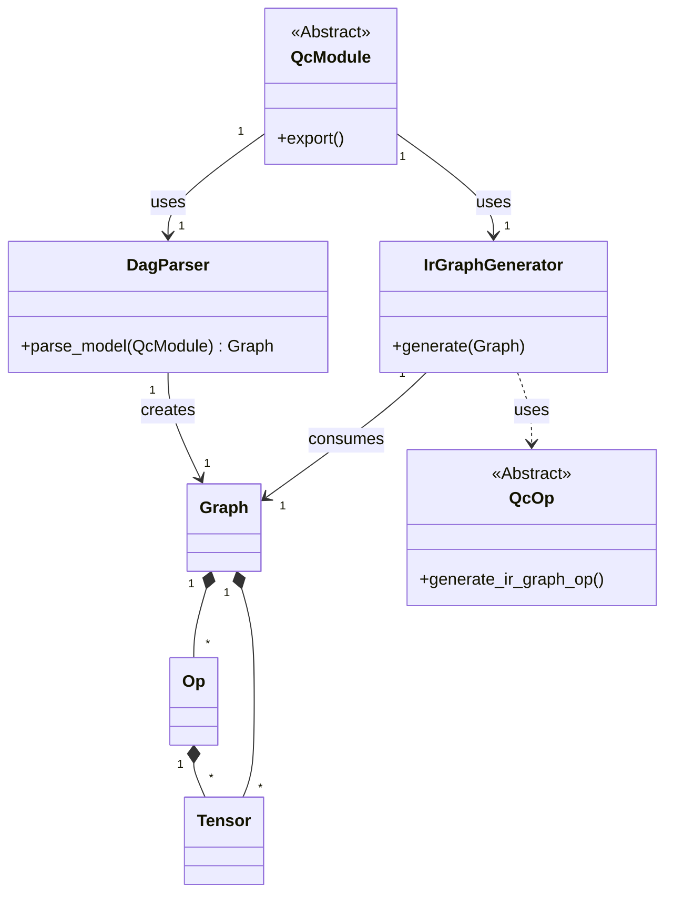
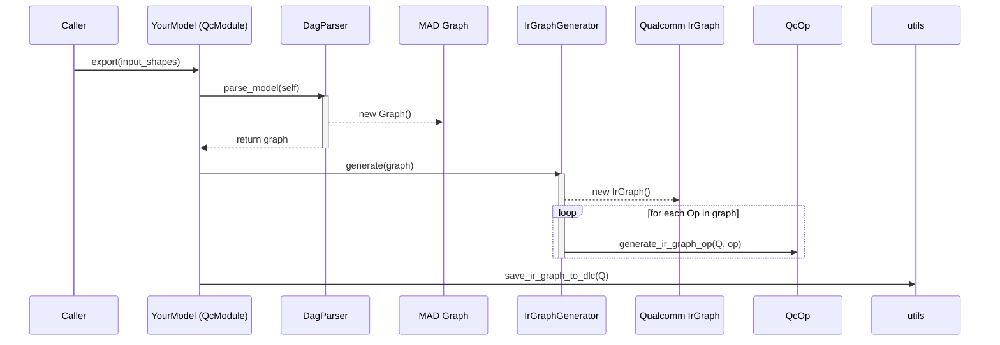

# MAD: Model Architecture & Definition - Technical Documentation

> **Note:** To properly render the diagrams in this document, you may need to use a markdown viewer with Mermaid.js support. If you are using Visual Studio Code, a recommended extension is **Markdown Preview Mermaid Support**.

## 1. Introduction to the MAD Library

**MAD (Model Assembly & Deployment)** is a Python library designed for the dynamic construction and serialization of neural network graphs. Its primary innovation is the use of **Abstract Syntax Tree (AST) parsing** to convert Python model definitions directly into a custom, framework-agnostic graph representation. This allows for a highly flexible and expressive way to define models, which can then be compiled into various hardware-specific formats, with an emphasis on the **Qualcomm DLC (Deep Learning Container)** format.

This document details the architecture of the MAD library and uses the included **GGUF-to-DLC converter** as a practical case study to illustrate its components and workflow.

## 2. MAD Library Architecture

The library is built on a few core components that work together to transform a Python class into a serialized model.

### 2.1. Core Abstractions (`lib/`)

-   **`QcModule` (`lib/module.py`):** The base class for all models defined with MAD. It is analogous to `torch.nn.Module`. It provides the essential `.export()` method that triggers the entire conversion pipeline. It also includes properties to recursively discover operations (`.layers`), attributes (`.attributes`), and sub-modules (`.submodules`) within a model definition.
-   **`QcOp` (`lib/op.py`):** The abstract base class for all neural network operations. Any new operation must inherit from `QcOp` and implement several key methods:
    -   `output_tensor_info()`: Calculates the shape and data type of the operation's output tensor(s).
    -   `get_static_inputs()`: Declares any static inputs, like weights or biases, that are part of the op's definition.
    -   `generate_ir_graph_op()`: A static method that contains the logic to convert the MAD `Op` into the target format's equivalent (e.g., a `Qualcomm IRGraph Op`).
-   **Op Registry:** A global dictionary (`OP_TYPE_TO_OP_CLASS`) that maps an op's `type` string to its `QcOp` class definition. This is crucial for the `IrGraphGenerator` to find the correct translation rule during serialization.

### 2.2. Graph Engine (`graph/`)

-   **Graph Components (`graph/components.py`):** Defines the `dataclasses` (`Graph`, `Tensor`, `Op`) that form MAD's internal, framework-agnostic graph representation. This clean separation between the model source and the target IR is a key architectural feature.
-   **AST Parser (`graph/parser.py`):** The `DagParser` is the heart of MAD. It takes a `QcModule` instance, inspects the source code of its `forward` method using `inspect.getsource`, and parses it into an AST. It then traverses this tree, interpreting Python statements to build the `Graph`:
    -   **Function Calls:** A call to a `QcOp` instance (e.g., `self.relu(x)`) creates an `Op` node in the graph.
    -   **Assignments:** An assignment (e.g., `x = self.relu(x)`) creates a `Tensor` node and establishes the dataflow link from the new `Op` to the variable `x`.
    -   **Control Flow:** The parser has built-in support for `for` loops and `if` statements, allowing these Python constructs to be unrolled and captured correctly within the static graph.
-   **IR Generator (`graph/ir_graph_gen.py`):** The `IrGraphGenerator` consumes the `Graph` object produced by the parser. Its job is to translate the MAD-specific graph into the target IR. It iterates through the `Graph`'s ops and tensors and creates their counterparts in the target `IrGraph`, using the `generate_ir_graph_op` static methods defined on each `QcOp` class.

### 2.3. Utilities (`utils.py`)

This module provides helper functions for tasks like saving the final `IrGraph` to a `.dlc` file, applying quantization encodings, and splitting a model graph into several sub-graphs.

## 3. Architectural Diagrams

### Class Diagram
This diagram shows the main classes of the MAD library and their relationships.

### Sequence Diagram: The `.export()` Flow
This diagram shows the sequence of events when `QcModule.export()` is called.

